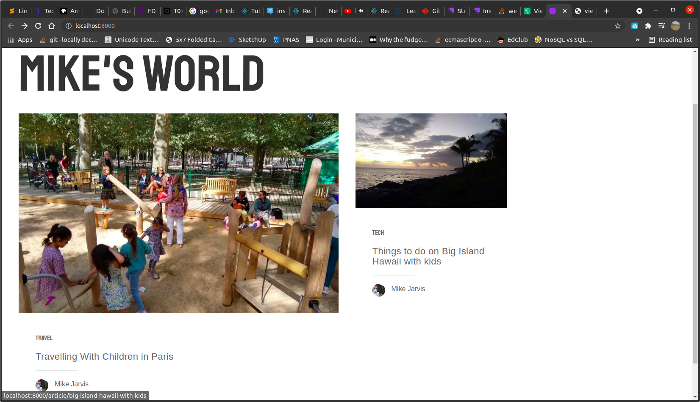

<P> My goal is to make a little blog to show potential employers <em>and</em> to work on over the next 5+ years. It will have little articles about things I'm interested in. It might have some tips and tricks for people about the things I've learned over the years, e.g. these travel tips in these destinations with kids, since we travel a lot.</p>



<p>I'm interested in driving traffic, productizing the site, since I've never done that before</p>

<p> Last week I explored a CMS called Strapi. It's got some Node, Gatsby underpinnings, among other things.  I would have used it, but it was a little hard to hook up to Google Cloud, which I'm using to host some of my projects, just because I've used it before at work.  I had a lot of code breaks just on getting it running locally.  I got into a github chat of Strapi devs and asked a few questions. I guess ultimately it offered some admin functionality that I didn't really need, especially at the cost of all the messy code breaks and lots of people contributing to the open source code.</p>

<p> I figured this week I would explore Gatsby to see if the framework would be beneficial to me </p>

<p> I've been learning React, which Gatsby utilizes, for a few weeks now, honestly, admittedly just because I see employers post jobs and learn-to-code YouTubers have recommended for obtaining coder jobs </p>

<p>My intention is to see if Gatsby, GraphQl, React, Webpack, etc. - all parts of the framework, are even necessary for what I'm building.  So far, it's different than Strapi, in that I got it running locally in a few minutes, after the download.  I'll have to see if I can put it onto Google Cloud very easily.  </p>

<p> I've not encountered having a framework that builds locally enter into a cloud build.  It seems like it should be easy, but it was the final straw for me with Strapi on Google Cloud, where I just said, F this, too much troubleshooting.</p>


<p align="center">
  <a href="https://www.gatsbyjs.com/?utm_source=starter&utm_medium=readme&utm_campaign=minimal-starter">
    
  </a>
</p>
<h1 align="center">
  Gatsby minimal starter
</h1>

## 🚀 Quick start

1.  **Create a Gatsby site.**

    Use the Gatsby CLI to create a new site, specifying the minimal starter.

    ```shell
    # create a new Gatsby site using the minimal starter
    npm init gatsby
    ```

2.  **Start developing.**

    Navigate into your new site’s directory and start it up.

    ```shell
    cd my-gatsby-site/
    npm run develop
    ```

3.  **Open the code and start customizing!**

    Your site is now running at http://localhost:8000!

    Edit `src/pages/index.js` to see your site update in real-time!

4.  **Learn more**

    - [Documentation](https://www.gatsbyjs.com/docs/?utm_source=starter&utm_medium=readme&utm_campaign=minimal-starter)

    - [Tutorials](https://www.gatsbyjs.com/tutorial/?utm_source=starter&utm_medium=readme&utm_campaign=minimal-starter)

    - [Guides](https://www.gatsbyjs.com/tutorial/?utm_source=starter&utm_medium=readme&utm_campaign=minimal-starter)

    - [API Reference](https://www.gatsbyjs.com/docs/api-reference/?utm_source=starter&utm_medium=readme&utm_campaign=minimal-starter)

    - [Plugin Library](https://www.gatsbyjs.com/plugins?utm_source=starter&utm_medium=readme&utm_campaign=minimal-starter)

    - [Cheat Sheet](https://www.gatsbyjs.com/docs/cheat-sheet/?utm_source=starter&utm_medium=readme&utm_campaign=minimal-starter)

## 🚀 Quick start (Gatsby Cloud)

Deploy this starter with one click on [Gatsby Cloud](https://www.gatsbyjs.com/cloud/):

[](https://www.gatsbyjs.com/dashboard/deploynow?url=https://github.com/gatsbyjs/gatsby-starter-minimal)
